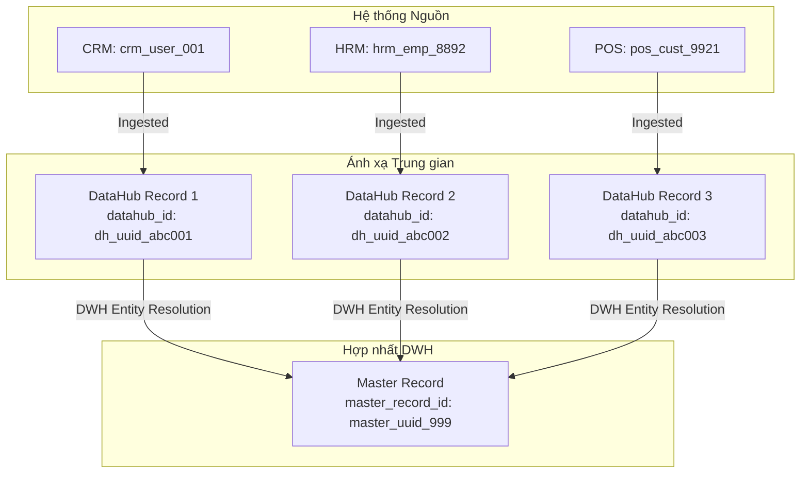

# Chuẩn Định Danh Dữ Liệu (Data Identifier Standard)

- **Mã Công Việc / Task Code:** P01-014
- **Trạng thái:** Bản phác thảo (Draft)
- **Áp dụng cho:** ETECHS Middleware (Ingestion) & Data Warehouse (DWH)

---

## 1. Mục tiêu (Objective)
Tài liệu này định nghĩa chuẩn định danh dữ liệu trong quá trình thu thập, xử lý và đồng bộ dữ liệu từ các hệ thống nguồn (Source Systems) về Data Lake, qua Middleware Mapping (DataHub) và chuyển tiếp tới Data Warehouse (DWH).

Chuẩn này giúp đảm bảo tính nhất quán của dữ liệu khi truy vết nguồn gốc (Data Lineage) và chuẩn bị cho quá trình hợp nhất thực thể (Entity Resolution / Customer Single View) ở các giai đoạn xử lý tiếp theo của DWH.

---

## 2. Các Trường Định Danh Cốt Lõi (Core Identifier Fields)

Mỗi bản ghi khi đi qua hệ thống Middleware sang DWH cần được định danh bằng bộ 5 trường thuộc tính sau:

| Trường thuộc tính | Kiểu dữ liệu | Mô tả | Ví dụ |
| :--- | :--- | :--- | :--- |
| `source_system` | `String` | Tên/mã của hệ thống nguồn phát sinh dữ liệu. | `CRM`, `ERP`, `HRM`, `POS_RETAIL` |
| `source_object` | `String` | Tên/loại đối tượng (thực thể) dữ liệu. | `user`, `customer`, `product`, `order` |
| `source_record_id` | `String` | ID khóa chính của bản ghi tại hệ thống nguồn (luôn lưu dưới dạng chuỗi). | `USR_99201`, `100234`, `c0a80101-7f` |
| `datahub_id` | `String (UUID)` | ID duy nhất sinh ra bởi Middleware (DataHub) sau khi bản ghi được map và lưu tại DataHub. | `a8b0c1d2-e3f4-5a6b-7c8d-9e0f1a2b3c4d` |
| `master_record_id` | `String (UUID)` | ID định danh duy nhất (Master ID) đại diện cho thực thể thực tế sau khi hợp nhất. | `e9f8d7c6-b5a4-3f2e-1d0c-9b8a7f6e5d4c` |

---

## 3. Nguyên Tắc Thiết Kế & Lộ Trình Triển Khai (Design Principles & Phases)

### Giai đoạn 1: Đồng bộ độc lập (Ingestion & Independent Mapping)
- **Không ép buộc hợp nhất (No Forced Merge):** Ở giai đoạn này, hệ thống **không** thực hiện gộp (merge) người dùng hoặc các thực thể trùng lặp giữa các hệ thống nguồn khác nhau.
- **Vai trò của Middleware:** Lưu trữ đầy đủ thông tin ánh xạ nguồn (`source_system`, `source_object`, `source_record_id`) và ánh xạ sang `datahub_id`. Trường `master_record_id` trong Giai đoạn 1 có thể tạm thời để trống (`null`) hoặc tự động gán bằng chính `datahub_id` của bản ghi đó.
- **Vai trò của DWH:** Nhận toàn bộ ánh xạ này từ Middleware để làm cơ sở chạy các thuật toán làm sạch, chuẩn hóa và hợp nhất dữ liệu ở các giai đoạn xử lý sâu hơn (ví dụ: Silver/Gold layers trong Data Warehouse).

---

## 4. Ví Dụ Ánh Xạ Định Danh (Mapping Examples)

Giả sử chúng ta có 3 hệ thống nguồn chứa thông tin người dùng (User/Customer) thực tế là cùng một người (ví dụ: ông Nguyễn Văn A):
1. **CRM**: ID nguồn là `crm_user_001`
2. **HRM**: ID nguồn là `hrm_emp_8892`
3. **POS**: ID nguồn là `pos_cust_9921`

### Sơ đồ Ánh xạ (Ingestion & Mapping Flow)



### Bảng Ánh xạ Chi tiết (Mapping Table Schema)

| source_system | source_object | source_record_id | datahub_id | master_record_id (Giai đoạn 1) | master_record_id (DWH sau khi xử lý) |
| :--- | :--- | :--- | :--- | :--- | :--- |
| `CRM` | `user` | `crm_user_001` | `dh_uuid_abc001` | `null` (hoặc `dh_uuid_abc001`) | `master_uuid_999` |
| `HRM` | `user` | `hrm_emp_8892` | `dh_uuid_abc002` | `null` (hoặc `dh_uuid_abc002`) | `master_uuid_999` |
| `POS` | `user` | `pos_cust_9921` | `dh_uuid_abc003` | `null` (hoặc `dh_uuid_abc003`) | `master_uuid_999` |

### Ví dụ JSON Payload lưu trữ tại DataHub

```json
{
  "source_system": "CRM",
  "source_object": "user",
  "source_record_id": "crm_user_001",
  "datahub_id": "9b1deb4d-3b7d-4bad-9bdd-2b0d7b3dcb6d",
  "master_record_id": null,
  "payload": {
    "full_name": "Nguyen Van A",
    "email": "a.nguyen@company.com",
    "phone": "0901234567"
  },
  "metadata": {
    "ingested_at": "2026-07-01T10:30:00Z",
    "version": "1.0.0"
  }
}
```
