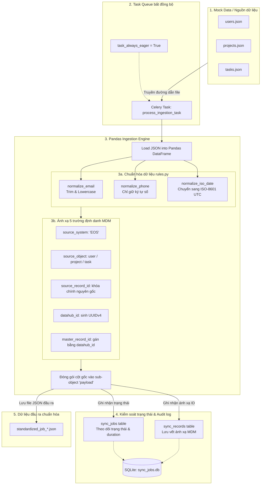

# Middleware Data Plane (middleware-de)

## Tổng quan
Đây là kho mã nguồn riêng biệt (`Data Plane`) chuyên xử lý Big Data theo đúng kiến trúc Ingestion Middleware (Enterprise Standard) đã định nghĩa trong OKF.

## Đặc tả Kiến trúc
Dựa trên tài liệu `enterprise_ingestion_architecture.md`:
- **Ngôn ngữ/Công nghệ**: Python, PySpark, Pandas, confluent-kafka, Redis.
- **Vai trò**: Đóng vai trò là Kafka Consumer liên tục hút dữ liệu từ topic `raw-ingestion-events`.
- **Decoupled Architecture**: Hoàn toàn tách biệt khỏi `middleware-be`. Không kết nối chung Database PostgreSQL.
- **Cơ chế chia sẻ Rule (Rule Sync)**: Đọc các Mapping Rule (do `middleware-be` đẩy sang) từ **Redis Cache** với tốc độ cao để xử lý dữ liệu.
- **Xử lý Ngoại lệ & Kháng lỗi**: Tích hợp cơ chế Dead Letter Queue (DLQ). Các record vi phạm Schema hoặc lỗi Validation sẽ được push vào topic DLQ.

## Cấu trúc thư mục (Base)
Dự án được khởi tạo cấu trúc cơ bản theo nguyên lý tách biệt module:
- `src/core/`: Chứa các cấu hình (Config).
- `src/domain/`: Chứa định nghĩa Entity, Schema Data (Canonical Schema).
- `src/application/`: Chứa logic xử lý Pipeline, Validation, Mapping.
- `src/infrastructure/`: Chứa các Adapter (Kafka Consumer, Redis Client).

---

## 4. Tích hợp Celery & Pandas (Data Ingestion Engine)
Để kiểm tra độc lập và không phụ thuộc vào trạng thái kết nối của Backend, dự án đã triển khai tích hợp công cụ xử lý dữ liệu hàng loạt bằng **Pandas** và quản lý tác vụ chạy nền bằng **Celery**:
- **Celery Ingestion Task**: Task `process_ingestion_task` nhận tệp dữ liệu nguồn JSON, nạp trực tiếp vào Pandas Engine.
- **Chuẩn hóa quy tắc (Rules)**: Thực hiện chuẩn hóa chuẩn hóa email (lowercase, trim), số điện thoại (chỉ giữ ký tự số), ngày tháng (chuyển đổi ISO-8601 UTC).
- **Tuân thủ 5 trường định danh MDM**:
  1. `source_system` (Hệ thống nguồn, ví dụ: `EOS`)
  2. `source_object` (Loại đối tượng, ví dụ: `user`, `project`, `task`)
  3. `source_record_id` (Khóa chính nguyên bản từ hệ thống nguồn)
  4. `datahub_id` (Định danh duy nhất dạng UUIDv4)
  5. `master_record_id` (Trong Phase 1 được gán bằng chính `datahub_id`)
  Mọi dữ liệu gốc còn lại được đóng gói trong thuộc tính con `payload`.
- **CSDL đối soát trạng thái (SQLite local)**: Theo dõi tiến độ của Job tại bảng `sync_jobs` và lưu vết ánh xạ ID định danh tại bảng `sync_records` trong SQLite (`data/sync_jobs.db`).

### Sơ đồ luồng dữ liệu Pipeline (Data Ingestion Architecture)


---

## 5. Hướng dẫn chạy Giả lập (Simulation & Verification)
Để chạy mô phỏng toàn bộ luồng xử lý và kết xuất bảng đối soát SQLite ra màn hình console, thực hiện câu lệnh:
```bash
python run_pipeline_demo.py
```

---

## 6. Đặc tả Định dạng Dữ liệu Đầu vào & Đầu ra (Data Schema Contract)

### 6.1. Dữ liệu Đầu vào (Raw JSON Input)
Dữ liệu thô từ các hệ thống nguồn (ví dụ hệ thống EOS) chưa được chuẩn hóa, chứa các ký tự thừa, chữ hoa/chữ thường lộn xộn hoặc sai định dạng ngày tháng:
```json
[
  {
    "id": "USR_1001",
    "name": "Nguyen Van A",
    "email": " NGUYENvANA@Gmail.com ",
    "phone": "+84 (909) 123-456",
    "created_at": "2026/07/01 08:30:00"
  }
]
```

### 6.2. Dữ liệu Đầu ra Chuẩn hóa (Standardized JSON Output)
Dữ liệu đầu ra sau khi chạy qua Pandas Engine sẽ được chuẩn hóa các trường thông tin nghiệp vụ và tự động bọc trong cấu trúc **Canonical Data Model (CDM)** tuân thủ **5 trường định danh MDM** ở lớp gốc:
```json
[
  {
    "source_system": "EOS",
    "source_object": "user",
    "source_record_id": "USR_1001",
    "datahub_id": "bef4410f-b9b6-464f-8a48-5e82fcfe3442",
    "master_record_id": "bef4410f-b9b6-464f-8a48-5e82fcfe3442",
    "payload": {
      "id": "USR_1001",
      "name": "Nguyen Van A",
      "email": "nguyenvana@gmail.com",
      "phone": "84909123456",
      "created_at": "2026-07-01T08:30:00"
    },
    "metadata": {
      "job_id": 1,
      "processed_at": "2026-07-04T15:15:43.642938"
    }
  }
]
```
> **Ghi chú:** 
> - Trường `email` đã được chuyển về chữ thường và loại bỏ khoảng trắng.
> - Trường `phone` đã được lọc bỏ tất cả các ký tự không phải số.
> - Trường `created_at` đã được chuẩn hóa về định dạng ISO-8601 UTC.
> - Khóa `datahub_id` dạng UUIDv4 được sinh ngẫu nhiên duy nhất cho mỗi bản ghi để quản lý định danh thực thể.

