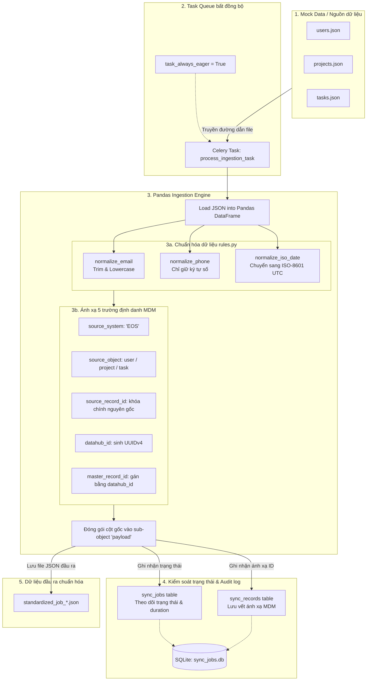

# ETECHS Ingestion Middleware - Data Engineer (DE) Service

Dịch vụ `middleware-de` chịu trách nhiệm thu thập (ingestion), ánh xạ (mapping), đồng bộ (sync), đối soát (reconciliation) và vận hành các tác vụ dữ liệu nền giữa hệ thống nguồn EOS, database trung gian (Middleware) và đích đến (DataHub).

Dự án được viết bằng **Python** và sử dụng kiến trúc thiết kế dạng đường ống đồng bộ (pipeline orchestration).

---

## 1. Cấu trúc thư mục chi tiết & Phân công công việc

Dưới đây là sơ đồ thư mục và cách ánh xạ từng tác vụ của **Data Engineer (Phan Trọng Nguyên)**:

```text
middleware-de/
├── config/                  # Cấu hình hệ thống (DB, Redis, Logger...)
│   ├── settings.py          # Cấu hình tham số môi trường
│   └── logger.py            # Logger tập trung (structlog)
│
├── docs/                    # Tài liệu đặc tả chuẩn hóa dữ liệu
│   ├── standards/
│   │   ├── identifier_standard.md  # [TASK 1] Chuẩn định danh dữ liệu
│   │   ├── metadata_framework.md   # [TASK 2] Khung Metadata Framework
│   │   └── standardization_rules.md # [TASK 3] Rule chuẩn hóa dữ liệu
│   └── architecture/
│       └── diagram.drawio          # [TASK 4] Sơ đồ kiến trúc Middleware
│
├── src/                     # Mã nguồn ứng dụng chính
│   ├── main.py              # File khởi chạy ứng dụng
│   │
│   ├── core/                # Thành phần cốt lõi dùng chung (Framework Core)
│   │   ├── connectors/      # API Client gọi các hệ thống ngoài
│   │   │   ├── eos_client.py       # [TASK 28,30,32,34,36,38] API Client kết nối EOS
│   │   │   └── datahub_client.py   # [TASK 7] DataHub Connector base (gọi API DataHub)
│   │   │
│   │   ├── sync/            # Bộ máy quản trị tiến trình đồng bộ
│   │   │   ├── engine.py           # [TASK 5] State machine quản lý trạng thái đồng bộ
│   │   │   └── checkpoint.py       # Quản lý checkpoint của delta sync
│   │   │
│   │   ├── queue/           # Xử lý hàng đợi & Tác vụ bất đồng bộ
│   │   │   ├── celery_app.py       # [TASK 6] Khởi tạo Celery & Redis 7
│   │   │   └── tasks.py            # Định nghĩa các task chạy background
│   │   │
│   │   └── standardization/ # Logic tiền xử lý & chuẩn hóa
│   │       └── rules.py            # [TASK 3] Các hàm chuẩn hóa (Email, Phone, ISO Date)
│   │
│   ├── pipelines/           # Luồng Ingestion (EOS -> Middleware -> DataHub)
│   │   ├── base.py                 # Abstract Class cho Pipeline
│   │   │
│   │   ├── organization/
│   │   │   ├── pull.py             # [TASK 8,15,28] Trích xuất và sync Organization từ EOS
│   │   │   ├── checkpoint.py       # [TASK 29] Delta sync/checkpoint cho Organization
│   │   │   └── reverse.py          # [TASK 40] Chuẩn bị chiều master DataHub -> EOS
│   │   │
│   │   ├── user/
│   │   │   ├── pull.py             # [TASK 9,16,30] Trích xuất và sync User/Employee từ EOS
│   │   │   ├── checkpoint.py       # [TASK 31] Delta sync/checkpoint cho User/Employee
│   │   │   └── reverse.py          # [TASK 41] Chuẩn bị chiều master DataHub -> EOS
│   │   │
│   │   ├── project/
│   │   │   ├── pull.py             # [TASK 10,17,32] Trích xuất và sync Project từ EOS
│   │   │   └── checkpoint.py       # [TASK 33] Delta sync/checkpoint cho Project
│   │   │
│   │   ├── task/
│   │   │   ├── pull.py             # [TASK 11,18,34] Trích xuất và sync Task từ EOS
│   │   │   └── checkpoint.py       # [TASK 35] Delta sync/checkpoint cho Task
│   │   │
│   │   ├── work_result/
│   │   │   ├── pull.py             # [TASK 12,26,36] Trích xuất và sync Work Result từ EOS
│   │   │   └── checkpoint.py       # [TASK 37] Delta sync/checkpoint cho Work Result
│   │   │
│   │   └── performance/
│   │       ├── pull.py             # [TASK 13,19,38] Trích xuất và sync Performance từ EOS
│   │       └── checkpoint.py       # [TASK 39] Delta sync/checkpoint cho Performance
│   │
│   ├── reconciliation/      # Các tiến trình đối soát (Reconciliation)
│   │   ├── base.py                 # Runner đối soát chung
│   │   ├── organization.py         # [TASK 42,43] Count & Missing đối soát Organization
│   │   ├── user.py                 # [TASK 44,45] Count & Missing đối soát User/Employee
│   │   ├── task.py                 # [TASK 46,47] Count & Missing đối soát Task
│   │   ├── work_result.py          # [TASK 48,49] Count & Missing đối soát Work Result
│   │   └── performance.py          # [TASK 50,51] Count & Missing đối soát Performance
│   │
│   └── api/                 # Endpoint REST phục vụ quản trị thủ công
│       ├── router.py               # Định tuyến API
│       └── endpoints/              # [TASK 22-27] Các endpoint Admin-only chạy lại sync
│           ├── organization.py
│           ├── user.py
│           ├── project.py
│           ├── task.py
│           ├── work_result.py
│           └── performance.py
│
├── tests/                   # Kiểm thử tích hợp (Integration Tests)
│   ├── integration/
│   │   ├── test_eos_to_middleware.py     # [TASK 14] Test luồng EOS -> Middleware core
│   │   ├── test_middleware_to_datahub.py  # [TASK 20] Test luồng Middleware -> DataHub
│   │   └── test_e2e_sync.py              # [TASK 21] Test E2E EOS -> Middleware -> DataHub
```

---

## 2. Công nghệ sử dụng
* **Ngôn ngữ:** Python 3.11+
* **Hàng đợi tác vụ (Queue/Retry):** Celery + Redis 7
* **Framework API:** FastAPI (Dành cho các Admin Retry Endpoint) (Em thấy dùng FastAPI là đủ không cần Django)
* **Kiểm thử:** Pytest

---

## 3. Quy trình Triển khai và Phát triển của DE
1. **Hoàn thiện Đặc tả & Chuẩn hóa:** Hoàn thành các file thiết kế tại `docs/standards/`.
2. **Xây dựng Core Framework:** Cài đặt các kết nối cơ bản (`eos_client.py`, `datahub_client.py`), cơ chế chuyển trạng thái đồng bộ (`sync/engine.py`), và hàng đợi Celery (`queue/celery_app.py`).
3. **Phát triển Từng Pipeline (Phát triển theo vòng lặp):**
   - Viết logic kéo dữ liệu (Pull).
   - Thiết lập kiểm tra thay đổi dữ liệu (Checkpoint).
   - Tích hợp chạy thật với API và đẩy lên DataHub.
4. **Viết Job Đối soát (Reconciliation):** Triển khai đối soát số lượng và tìm bản ghi lệch tại `reconciliation/`.
5. **Viết Test:** Chạy tích hợp và kiểm thử E2E sử dụng pytest để đảm bảo luồng dữ liệu thông suốt, không bị mất mát hay sai lệch.

---

## 4. Chi tiết từng bước hoạt động của Middleware-DE Ingestion Engine

Sơ đồ kiến trúc xử lý dữ liệu chi tiết của Pipeline:



Hệ thống xử lý dữ liệu (data pipeline) bất đồng bộ thông qua Celery và Pandas tuân thủ quy trình 4 bước chính:

### Bước 1: Khởi tạo và Thiết lập Trạng thái (Job Initialization)
- Khi nhận yêu cầu đồng bộ, `SyncEngine` sẽ tạo một Sync Job mới với trạng thái ban đầu là `pending` trong SQLite database (`data/sync_jobs.db`).
- Ghi nhận `source_system` (ví dụ: 'EOS'), `object_type` (ví dụ: 'user', 'project', 'task'), và `start_time` để đo lường hiệu năng.

### Bước 2: Nạp và Chuẩn hóa Dữ liệu (Validation & Standardization)
- Trạng thái Job chuyển sang `validating`.
- Sử dụng thư viện **Pandas** để nạp tệp dữ liệu JSON nguồn thành một DataFrame nhằm tối ưu hóa xử lý hàng loạt.
- Thực hiện chuẩn hóa dữ liệu qua các bộ quy tắc trong `src/core/standardization/rules.py`:
  - **Email**: Chuyển về chữ thường (lowercase) và loại bỏ khoảng trắng thừa (`normalize_email`).
  - **Số điện thoại**: Loại bỏ ký tự không phải số (`normalize_phone`).
  - **Ngày tháng**: Chuẩn hóa về định dạng ISO-8601 UTC (`normalize_iso_date`).

### Bước 3: Ánh xạ chuẩn 5 trường định danh MDM (MDM Identifier Mapping)
- Trạng thái Job chuyển sang `mapping`.
- Xác định khóa ID gốc từ hệ thống nguồn (`source_record_id`).
- Tạo mới khóa định danh `datahub_id` bằng UUIDv4 duy nhất cho từng bản ghi.
- Thiết lập trường định danh `master_record_id` (Trong Giai đoạn 1, tự động gán bằng chính `datahub_id` của bản ghi đó).
- DataFrame kết quả sẽ có cấu trúc chuẩn MDM ở lớp gốc:
  - `source_system`
  - `source_object`
  - `source_record_id`
  - `datahub_id`
  - `master_record_id`
  Các trường thông tin nghiệp vụ/dữ liệu gốc còn lại sẽ được lưu trữ bên trong một đối tượng con (`payload`).

### Bước 4: Đẩy dữ liệu và Hoàn tất (Pushing & Completion)
- Trạng thái Job chuyển sang `pushing_datahub`.
- Thực hiện đẩy gói dữ liệu đã chuẩn hóa lên DataHub API (Trong môi trường demo, ghi trực tiếp xuống file JSON tại thư mục `data/standardized/`).
- Ghi nhận thông tin ánh xạ ID của từng bản ghi vào bảng `sync_records` trong SQLite phục vụ audit và đối soát (Reconciliation).
- Chuyển trạng thái Job sang `completed` (hoặc `failed` kèm chi tiết lỗi `error_detail` nếu phát sinh ngoại lệ), ghi nhận thời gian hoàn tất (`end_time`) và tính toán tổng thời gian xử lý (`duration`).

---

## 5. Hướng dẫn Giả lập & Chạy thử nghiệm độc lập (E2E Demo)

Hệ thống hỗ trợ chạy thử nghiệm nhanh toàn bộ pipeline độc lập không phụ thuộc vào Redis Server hay DB Backend:

1. **Cài đặt thư viện:**
   ```bash
   pip install -r requirements.txt
   ```

2. **Chạy kịch bản giả lập:**
   ```bash
   python run_pipeline_demo.py
   ```
   *Kịch bản này sẽ tự động sinh dữ liệu giả lập (users, projects, tasks) tại `data/raw/`, cấu hình Celery chạy ở chế độ eager mode (`task_always_eager=True`), đẩy dữ liệu qua Engine chuẩn hóa MDM và in bảng kết quả truy vấn SQLite trực tiếp ra màn hình.*

---

## 6. Kết quả Kiểm thử Hàm Xử lý (Test Results)

### 6.1. Dữ liệu đầu vào (Mock Data)

#### Users (users.json — 3 records)
| employee_id | full_name | email | phone | created_at |
|---|---|---|---|---|
| USR_1001 | Phan Trọng Nguyên | `"  TrongNguyen.Phan@Etechs.Com.vn  "` | `"+84 901-234-567"` | `2026-07-01T10:30:00Z` |
| USR_1002 | Lê Tuấn Đạt | `"DAT.LT@Etechs.vn"` | `"0987.654.321"` | `2026/06/15 08:12:34` |
| USR_1003 | Dương Ngọc Hân | `"  Han.Duong@etechs.vn"` | `"0912-345-678 "` | `2026-05-20` |

#### Projects (projects.json — 2 records)
| id | name | status | created_date |
|---|---|---|---|
| PRJ_5001 | Hệ thống Tích hợp ETECHS Middleware | active | `2026-01-10T00:00:00Z` |
| PRJ_5002 | Nâng cấp Cổng dịch vụ EOS | planning | `2026-03-15T09:00:00Z` |

#### Tasks (tasks.json — 3 records)
| task_id | project_id | title | priority | due_date |
|---|---|---|---|---|
| TSK_9001 | PRJ_5001 | Xây dựng Ingestion Engine với Celery & Pandas | HIGH | `2026-07-10T17:00:00Z` |
| TSK_9002 | PRJ_5001 | Thiết kế chuẩn 5 trường định danh MDM | CRITICAL | `2026-07-05T12:00:00Z` |
| TSK_9003 | PRJ_5002 | Khảo sát API Endpoint hệ thống EOS | MEDIUM | `2026-08-01T18:00:00Z` |

---

### 6.2. Kết quả Chuẩn hóa (Standardization Output)

So sánh **trước → sau** khi qua các hàm xử lý trong `src/core/standardization/rules.py`:

#### `normalize_email()` — Trim & Lowercase
| Trước | Sau | Hàm xử lý |
|---|---|---|
| `"  TrongNguyen.Phan@Etechs.Com.vn  "` | `trongnguyen.phan@etechs.com.vn` | `email.strip().lower()` |
| `"DAT.LT@Etechs.vn"` | `dat.lt@etechs.vn` | `email.strip().lower()` |
| `"  Han.Duong@etechs.vn"` | `han.duong@etechs.vn` | `email.strip().lower()` |

#### `normalize_phone()` — Chỉ giữ ký tự số
| Trước | Sau | Hàm xử lý |
|---|---|---|
| `"+84 901-234-567"` | `84901234567` | `re.sub(r'\D', '', phone)` |
| `"0987.654.321"` | `0987654321` | `re.sub(r'\D', '', phone)` |
| `"0912-345-678 "` | `0912345678` | `re.sub(r'\D', '', phone)` |

#### `normalize_iso_date()` — Chuẩn hóa ISO-8601
| Trước | Sau | Hàm xử lý |
|---|---|---|
| `2026-07-01T10:30:00Z` | `2026-07-01T10:30:00+00:00` | `fromisoformat` + replace Z |
| `2026/06/15 08:12:34` | `2026-06-15T08:12:34` | `strptime` format `%Y/%m/%d %H:%M:%S` |
| `2026-05-20` | `2026-05-20T00:00:00` | `strptime` format `%Y-%m-%d` |
| `2026-01-10T00:00:00Z` | `2026-01-10T00:00:00+00:00` | `fromisoformat` + replace Z |
| `2026-07-10T17:00:00Z` | `2026-07-10T17:00:00+00:00` | `fromisoformat` + replace Z |

---

### 6.3. Kết quả Ánh xạ 5 trường định danh MDM

Mỗi bản ghi sau khi xử lý được bổ sung 5 trường MDM ở lớp gốc:

| source_system | source_object | source_record_id | datahub_id | master_record_id |
|---|---|---|---|---|
| EOS | user | USR_1001 | `e3e71221-...` | `e3e71221-...` |
| EOS | user | USR_1002 | `8ed9c803-...` | `8ed9c803-...` |
| EOS | user | USR_1003 | `a9e90eb1-...` | `a9e90eb1-...` |
| EOS | project | PRJ_5001 | `196feb9f-...` | `196feb9f-...` |
| EOS | project | PRJ_5002 | `599772fd-...` | `599772fd-...` |
| EOS | task | TSK_9001 | `99e4fbc3-...` | `99e4fbc3-...` |
| EOS | task | TSK_9002 | `a2dca6dc-...` | `a2dca6dc-...` |
| EOS | task | TSK_9003 | `22d2bf43-...` | `22d2bf43-...` |

*`datahub_id` và `master_record_id` được sinh bằng UUIDv4 — trong Phase 1, `master_record_id` được gán bằng `datahub_id`.*

---

### 6.4. Output JSON chuẩn hóa (Standardized Payload)

Ví dụ cấu trúc file `user_standardized_job_1.json`:

```json
[
  {
    "source_system": "EOS",
    "source_object": "user",
    "source_record_id": "USR_1001",
    "datahub_id": "e3e71221-deac-47d0-85e3-c5e64d7f1e94",
    "master_record_id": "e3e71221-deac-47d0-85e3-c5e64d7f1e94",
    "payload": {
      "employee_id": "USR_1001",
      "full_name": "Phan Trọng Nguyên",
      "email": "trongnguyen.phan@etechs.com.vn",
      "phone": "84901234567",
      "created_at": "2026-07-01T10:30:00+00:00"
    },
    "metadata": {
      "job_id": 1,
      "ingested_at": "2026-07-04T13:42:23.143887"
    }
  }
]
```

---

### 6.5. Kết quả Kiểm soát trạng thái (SQLite Audit Log)

#### Bảng `sync_jobs` — Theo dõi tiến trình
| id | source_system | object_type | status | start_time | end_time | duration |
|---|---|---|---|---|---|---|
| 1 | EOS | user | completed | 2026-07-04T13:42:23 | 2026-07-04T13:42:23 | 0.146s |
| 2 | EOS | project | completed | 2026-07-04T13:42:23 | 2026-07-04T13:42:23 | 0.124s |
| 3 | EOS | task | completed | 2026-07-04T13:42:23 | 2026-07-04T13:42:23 | 0.069s |

*State machine: `pending → validating → mapping → pushing_datahub → completed`*

#### Bảng `sync_records` — Audit trail ánh xạ MDM
| id | job_id | source_system | source_object | source_record_id | datahub_id | master_record_id |
|---|---|---|---|---|---|---|
| 1 | 1 | EOS | user | USR_1001 | `e3e71221-...` | `e3e71221-...` |
| 2 | 1 | EOS | user | USR_1002 | `8ed9c803-...` | `8ed9c803-...` |
| 3 | 1 | EOS | user | USR_1003 | `a9e90eb1-...` | `a9e90eb1-...` |
| 4 | 2 | EOS | project | PRJ_5001 | `196feb9f-...` | `196feb9f-...` |
| 5 | 2 | EOS | project | PRJ_5002 | `599772fd-...` | `599772fd-...` |
| 6 | 3 | EOS | task | TSK_9001 | `99e4fbc3-...` | `99e4fbc3-...` |
| 7 | 3 | EOS | task | TSK_9002 | `a2dca6dc-...` | `a2dca6dc-...` |
| 8 | 3 | EOS | task | TSK_9003 | `22d2bf43-...` | `22d2bf43-...` |

---

### 6.6. Tổng hợp kết quả kiểm thử

| Chức năng | Input | Output | Trạng thái |
|---|---|---|---|
| `normalize_email` | 3 emails không chuẩn (hoa/thường, khoảng trắng) | 3 emails chuẩn lowercase, trimmed | ✅ Pass |
| `normalize_phone` | 3 số điện thoại có ký tự đặc biệt (+, -, ., space) | 3 số chỉ gồm digits | ✅ Pass |
| `normalize_iso_date` | 3 định dạng ngày khác nhau (Z, `/`, `-`) | 3 ngày chuẩn ISO-8601 | ✅ Pass |
| 5 MDM fields mapping | 8 records từ 3 object types | 8 records có đủ 5 MDM fields | ✅ Pass |
| SQLite sync_jobs | 3 jobs chạy qua state machine | 3 jobs status = `completed`, có duration | ✅ Pass |
| SQLite sync_records | 8 records với MDM mapping | 8 records trong audit trail | ✅ Pass |
| Total throughput | 8 records, 3 object types | Thời gian xử lý ~ **0.34s** | ✅ Pass |

